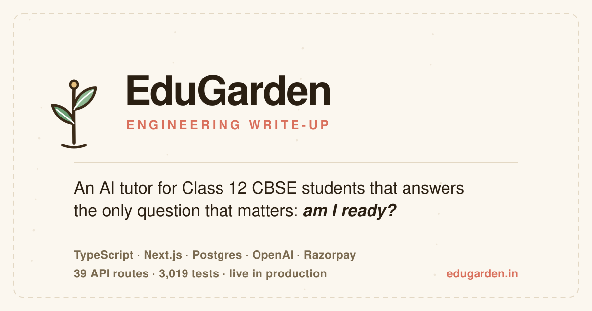

# EduGarden — engineering write-up

**An AI study companion for Class 12 CBSE students in India.**

Most AI tutors answer questions. EduGarden tries to answer the one that actually keeps a Class 12 student up at night — *"am I ready for the boards?"* — with a number that moves as they study.

🔗 **[edugarden.in](https://edugarden.in)**

> **This repository is the write-up, not the source.** EduGarden is a live commercial product and
> its code is private. What's here is the architecture, the decisions, and the reasoning — the
> parts worth reading anyway.

---

## The problem

An Indian Class 12 student has ~70 chapters, one set of board exams, and no reliable signal about where they actually stand. Coaching is expensive and generic. A general chatbot will happily explain anything but remembers nothing, tracks nothing, and can't tell them what to study next.

EduGarden is built around the things a chatbot structurally cannot do: **persistence, measurement, and pacing.**

- **Arya**, the tutor, teaches in natural Hinglish — the register these students actually think in — using guided discovery rather than dumping answers.
- **A predicted board score** derived from real graded work, per subject, at the correct paper marks (70 for PCB, 80 for Maths/English).
- **A weakness model** that measures struggle rather than exposure, decaying over time so old mistakes stop haunting a student who has moved on.
- **A study plan** that produces a time-blocked *day*, not a chapter dumped on a date.

---

## See it running

**[edugarden.in](https://edugarden.in)** — the landing page runs a live demo of the tutor, no account needed.

<!-- SCREENSHOTS: four captures go here. See assets/screenshots/HOWTO.md for what to
     shoot and the exact table to paste in. Left commented until the files exist, so
     nothing ever renders as a broken image. -->

---

## What it does

| | |
|---|---|
| **Tutor** | Streaming SSE chat, Hinglish or English, four teaching specialists (a board-answer examiner, a stress coach, a what-to-skip strategist), photo doubt-solving |
| **Curriculum** | 70 NCERT chapters across Physics, Chemistry, Mathematics, English and Biology; stream presets so a medical student never sees a Maths chapter |
| **Assessment** | Free diagnostic, per-chapter tests, full board papers at real paper structure, AI grading, and a predicted score that states its own confidence |
| **Practice** | ~400 searchable formulas, 150+ chapter diagrams, a PYQ bank, derivation walkthroughs, graded spaced-revision recall checks, and a mistake notebook that classifies *why* answers slip |
| **Habit** | XP and levels, badges, streaks with earned freezes, a virtual garden that grows per subject, a Pomodoro timer |
| **Platform** | Google OAuth, PWA, Razorpay payments, referrals, student-initiated parent reports, an owner analytics dashboard |

---

## Architecture highlights

The parts that were actually hard. Longer versions in [`docs/`](docs/).

### Usage metering lives in Postgres, not the app

A daily "energy" pool meters every AI action. The rule that matters: **the client is never trusted with identity or price.** Consumption goes through a `SECURITY DEFINER` RPC that reads `auth.uid()` internally, resolves the caller's tier from the subscriptions table, and does an atomic check-then-increment against an IST day boundary.

```
consume_energy(units, base_budget, weekly_budget, premium_budget)
  → identity  from auth.uid()      (never a request parameter)
  → tier      from subscriptions   (never a client claim)
  → atomic increment, fails OPEN so a metering outage can't take chat down
```

No tier is unlimited. Every paid plan is capped, so even a maxed-out user stays profitable at the underlying token cost — which is what makes a genuinely useful free tier affordable.

→ [`docs/metering-and-cost.md`](docs/metering-and-cost.md)

### Payments verify server-side, and only in one place

Both the student and parent checkout flows delegate to a single `finalizePayment()`: HMAC-SHA256 signature check, then the plan **and amount are re-derived from a server-side registry** and required to match exactly. A client only ever sends a coupon *code*, never a price. It's the most security-sensitive path in the codebase, so it's the most heavily unit-tested one.

### A prompt that's assembled per turn, not shipped whole

A heuristic router classifies each turn (`confused`, `numerical`, `exam`, `emotional`, …) and selects only the prompt modules that turn needs. Reward pacing that an LLM can't honour from memory — *"a board-exam hook roughly 1 turn in 3, never reuse an analogy"* — is computed deterministically in TypeScript and injected as a budget.

Message layout is **prompt-cache-aware**: stable content goes in a system message *before* the history, per-turn content *after* it, so a changing block can't invalidate the cached prefix.

→ [`docs/architecture.md`](docs/architecture.md)

### A shared content cache across all students

Deterministic generations (revision sheets, derivations, NCERT solutions) are identical for every student on the same chapter. Browser caching only dedupes per *device*; a Postgres-backed cache dedupes per *platform*. The first student pays the generation, everyone after reads the row — 6.7s → 511ms, and one API call instead of hundreds.

Students are still charged energy on a hit. The cache reduces *our* cost, not their allowance.

### Diagrams are generated, then independently verified

150+ chapter figures are produced by script, not drawn by hand — and a separate verifier re-derives every mathematical claim rather than diffing the file. Alpha-scattering trajectories are numerically integrated and checked against the analytic result; Hardy–Weinberg is checked to sum to 1; a catalysed energy profile is checked to share reactant and product levels with the uncatalysed one, because a catalyst cannot change ΔH.

These figures get copied into board answers. A parabola that isn't really y = x² is a wrong answer taught confidently.

### Deterministic where AI adds nothing

The predicted score, the study planner, the weakness model, and the mistake notebook are pure TypeScript with zero API cost. A weekly plan built by an LLM would be slower, non-reproducible, and no better.

→ [`docs/decisions.md`](docs/decisions.md)

### Compliance as configuration

India's DPDP Act restricts behavioural monitoring of minors even with parental consent. Every tracking feature is tagged `service` vs `behavioural` in one map, and a single resolver decides what may be persisted for a given user. Teaching always works; only writes are gated. **Adjusting the legal line means editing one file, not auditing every call site.**

---

## Tech stack

| Layer | Choice |
|---|---|
| Framework | Next.js 14.2 (App Router, mixed edge/node runtimes) |
| Language | TypeScript 5.5, strict |
| UI | Tailwind CSS 3.4, Framer Motion 11, Radix primitives, KaTeX |
| AI | OpenAI — `gpt-4o-mini` for chat, vision and generation; `gpt-4o` for derivations only |
| Data | Supabase (Postgres, RLS, Google OAuth), localStorage as a synchronous read cache |
| Payments | Razorpay |
| Observability | Sentry, PostHog |
| Testing | Vitest — 2,664 tests across 127 files |

**Model choice is deliberate.** `gpt-4o-mini` is ~15× cheaper than `gpt-4o` and indistinguishable for this workload. `gpt-4o` is reserved for derivations, where the smaller model drops algebra terms mid-proof — and a wrong derivation would poison the shared cache for every student for 30 days.

---

## Scale

| | |
|---|---|
| ~157,000 | lines of TypeScript |
| 39 | API route handlers |
| 61 | SQL migrations |
| 70 | curriculum chapters |
| 2,664 | unit tests, across 127 files |

---

## Testing

Unit tests cover the paths where a bug costs money or breaks trust: payment verification, usage-tier margins, the predicted-score maths, the privacy tracking gate, and cross-file chapter agreement. UI is deliberately not unit-tested — the value is in the invariants.

Beyond unit tests, an **LLM-judged eval harness** runs fixture conversations to catch teaching-behaviour regressions that types can't see. It comes with a hard-won caveat: three runs of an identical build scored 34, 37 and 43 out of 48 at temperature 0.7. It's a smoke alarm for gross breakage, not a referee for small changes — and treating it as the latter produced three wrong diagnoses before that was understood.

CI runs typecheck → lint → test → build on every push to `main`. **The build requires no API credentials** — SDK clients are constructed lazily inside handlers rather than at module scope, so CI never needs a real key.

---

## Deep dives

| | |
|---|---|
| [Architecture](docs/architecture.md) | Request lifecycle, the edge/node split, how a prompt is assembled per turn, three layers of caching |
| [Metering & cost](docs/metering-and-cost.md) | Why the meter lives in Postgres, prompt-cache discipline, and measuring cost instead of estimating it |
| [Data model](docs/data-model.md) | Schema, RLS posture, the `SECURITY DEFINER` pattern, and localStorage-as-cache with reconcile-on-sign-in |
| [Decisions](docs/decisions.md) | The trade-offs, including the ones that turned out wrong |

---

## How this was built

Developed with heavy use of AI coding tools. That's why a living architecture spec sits in the repo root — it documents the invariants and conventions that both the tooling and I work from, and it's the reason the single-source-of-truth modules stay single-source.

Working that way is only safe with guardrails, so those are the parts I'd point at first: unit tests concentrated where a bug costs money or breaks trust, an eval harness for behaviour that types can't check, and exactly one documented owner for every value that could drift.

The failure mode all of that targets is not hypothetical. Four separate files carried chapter counts. They disagreed about English. The same student saw *"12 / 19 chapters"* on one screen and *"12 / 20"* on another, and nothing caught it — no type error, no failing test, no crash. A test now exists so that class of drift can't come back quietly.

---

<sub>Built by <a href="https://github.com/Abhinoor01">Abhinoor Singh</a>. Not affiliated with CBSE or NCERT.</sub>
